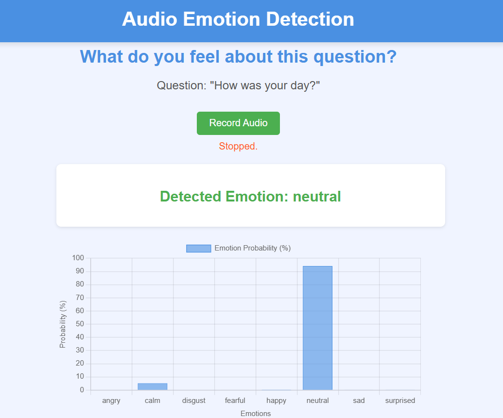

# Real-Time Audio Emotion Detection

This project is a Flask-based web application that records user audio, predicts the emotion expressed in the recording, and stores the data (including probabilities for each emotion) in an SQLite database. It uses **librosa** for feature extraction and a pre-trained machine learning model for emotion classification.

## Application Interface



---

## Features
- **Real-Time Audio Recording**: Record audio through the app interface.
- **Emotion Prediction**: Classify the emotion of the recorded audio into categories like `neutral`, `happy`, `sad`, etc.
- **Database Storage**: Save audio recordings and their predicted emotions in an SQLite database.
- **Probabilities for Each Emotion**: Get the probability for each emotion along with the predicted emotion.
- **Audio Retrieval**: Retrieve stored audio from the database and reanalyze it.

---

## Prerequisites
Make sure you have the following installed:
- Python 3.7 or later
- Flask
- Required Python libraries:
  - `librosa`
  - `numpy`
  - `pyaudio`
  - `soundfile`
  - `sqlite3`
  - `scikit-learn`
- Trained model and scaler files:
  - Place them in `audio_recorder/models/` as:
    - `trained_model.pkl`
    - `scaler.pkl`

---

## Installation

1. Clone the repository:
   ```bash
   git clone git clone https://github.com/PriyaKapgate/speech-emotion-recognition.git
cd audio-emotion-detection
   cd audio-emotion-detection
